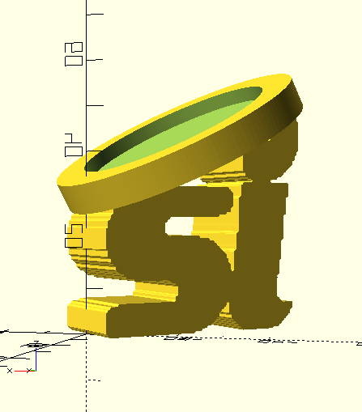

# Old si logo

The old logo the company used before it got bought by big red.

I used OpenSCAD to convert it to a challenge coin holder, but it would really
benefit from me having a vectorized version of the si, the 3d print looks very
pixelated.

