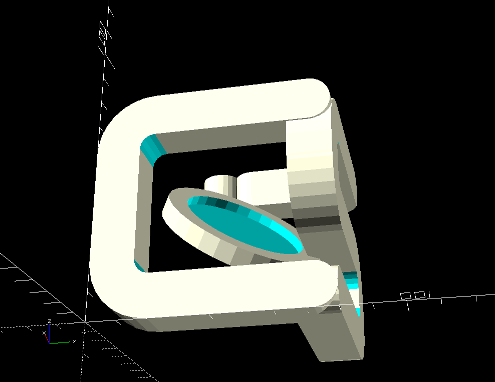
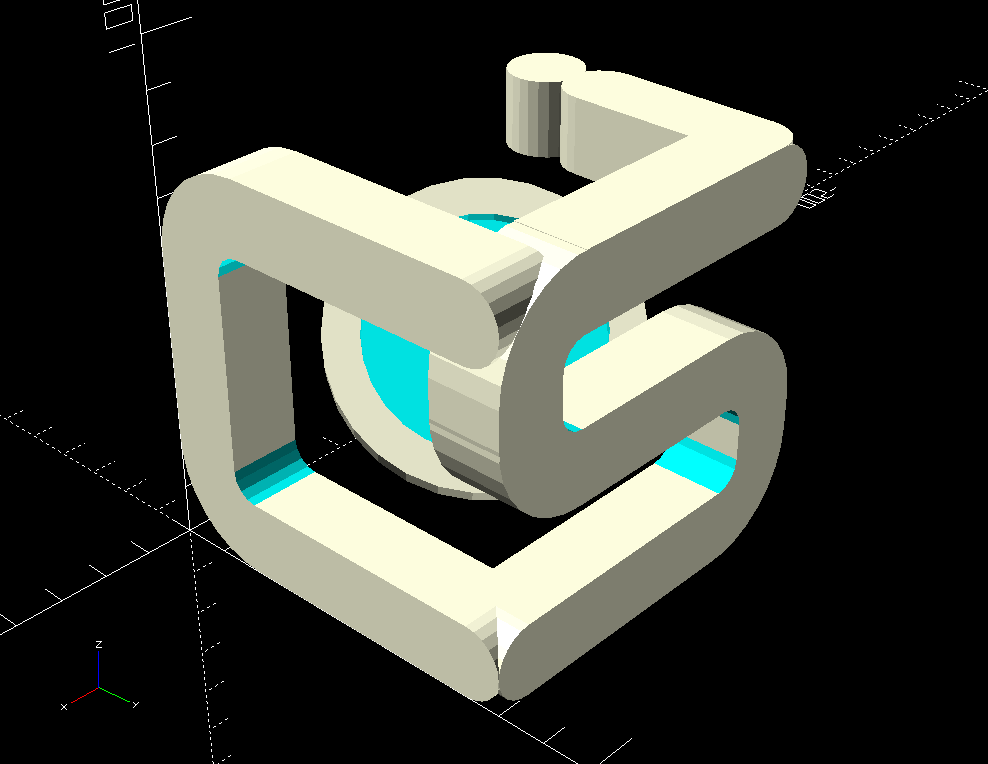
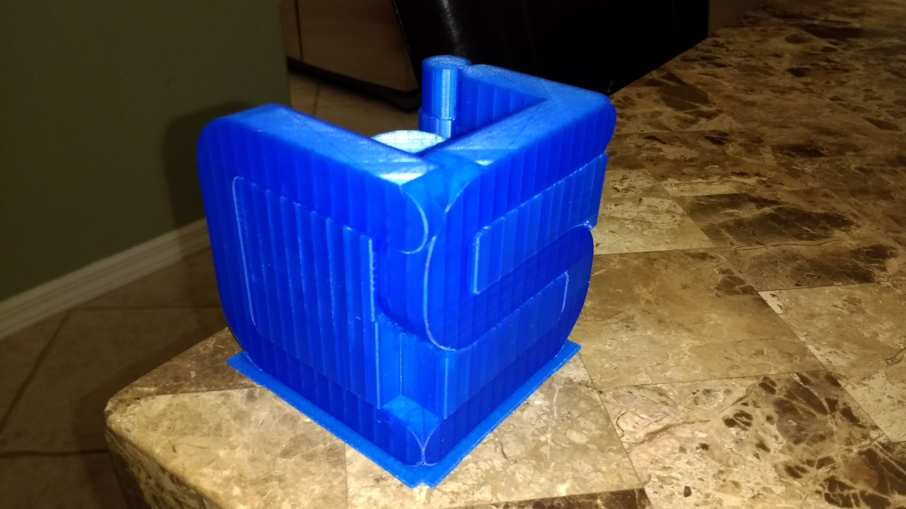
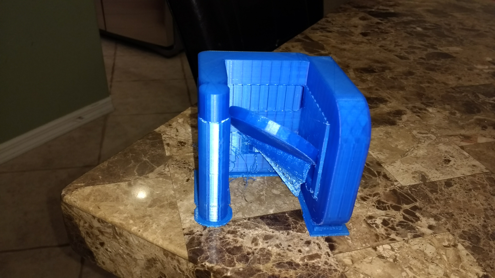
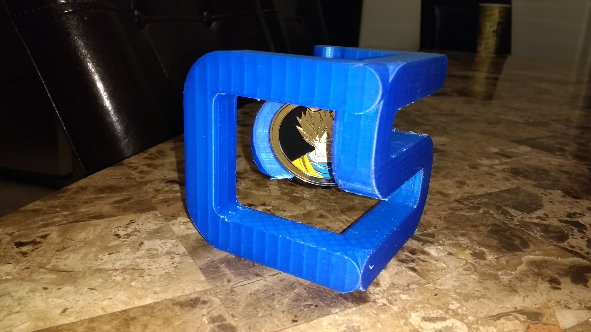

= 3D Logo =

Company game me a cool challenge coin for anniversary (the back has how many
you have been with the company).  I wanted something to cool to put it in.  So
I made the following challenge coin holder.

Designed with OpenSCAD on Ubuntu.  Printed on Monoprice 3d Mini Printer.  Took
about 18 hours for me to print (not exact, was doing other things).  Sliced 
with Cura.

== Issues ==

* I need better support under the challenge coin, it didn't print very well on
  my MonoPrice Mini.
* While it does stay upright, it doesn't take much force at all to make the
  whole thing roll backwards.  If I made better support for the coin, maybe it
  would be more stable
* It prints with tons of supports.  Takes a while to remove all of them.
  Should come up with a better orientation for printing it

== Renderings ==

== Photos as Printed, nothing removed yet ==

== Photos Final ==

Removed supports, and inserted challenge coin, which fitted perfectly!

