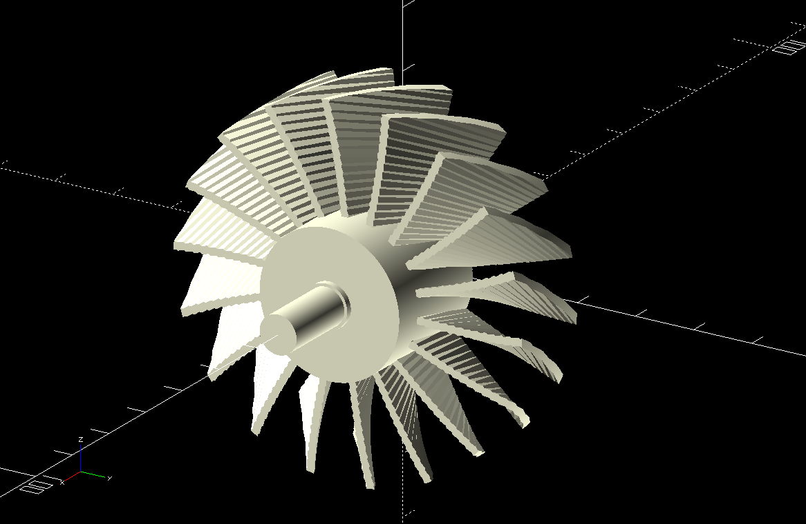

# 3d-printing
Models and any scripts I create to help with 3D printing needs

## [Badge Holder](badge-holder)

This doesn't actually print, I need to work on it later.

## [3-D Printer Enclosure](printer_enclosure)

An enclosure I created from some 3d printed parts, and some large pieces of
Lexan / Polycarbonate sheets.

## [Logo and Challenge Coin Holder](3dlogo)

This was a semi-successful print.  The logo part came out good, but the coin
holder part only partially printed successfully.  Going to work on some
improvements for it.

## [Headphone and Cellphone Holder](headphone)

Holds my Bluetooth headphones or my cell phone

## [POE Network Switch Mounting Bracket](switch_bracket)

I have a Leviton Structured Media Network enclosure in my house that has
all the household network wiring cables going to it.  I need to add a POE
switch to power and network all of my security cameras.  The enclosure has
holes all through it that you can mount their brand equipment in very easily.
This is my effort to make a bracket to mount non-Leviton brand equipment in
the enclosure.

## [Turbofan](turbofan)

Working on a project to try to add a DC powered jet fan to a pinewood derby
car.  Not sure if I can really effectivly print the small fan blades, or glue
them together and have them not fall apart, but figured it might be fun to try.

(Not really legal for pinewood derby)

## [Power Supply Case](power_supply_enclosure/readme.md)

Case for cheap DC-DC power supply from web.
