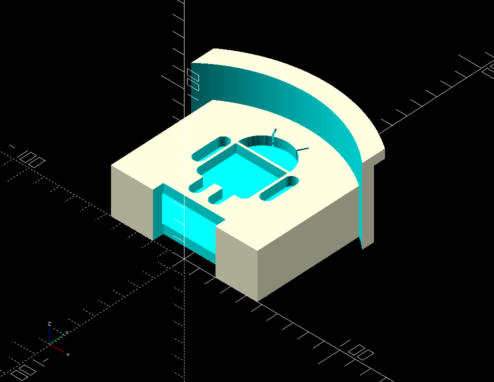
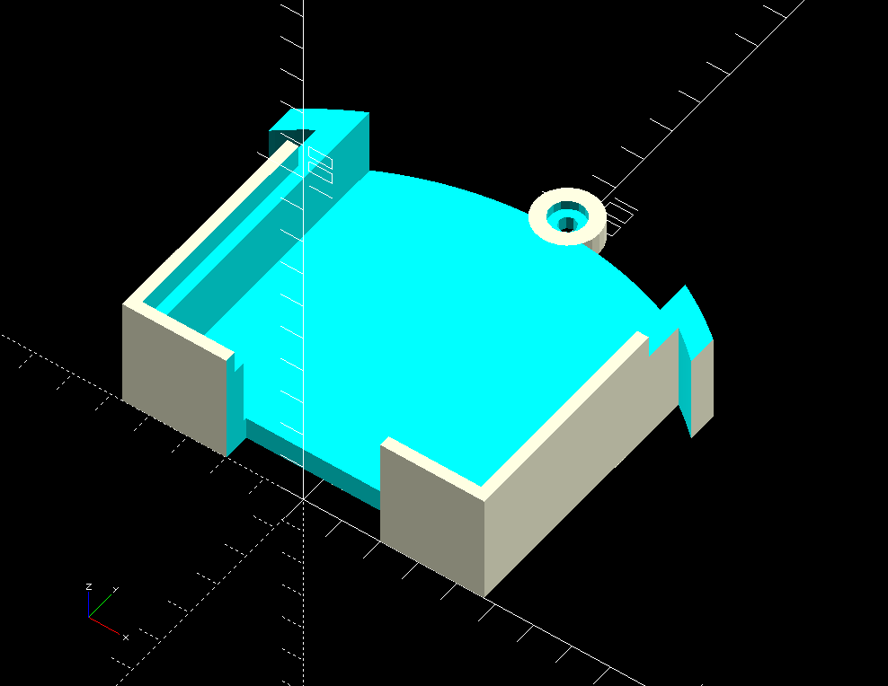

# Headphone / Cellphone Holder

I don't like to plug my cell phone or bluetooth headphones into my work PC
to charge them, instead I use a USB wall charger.  The cord barely reaches my
desk, so I often end up putting my headphones in my extended desk drawer while
they are charging.

I've decided to end this by creating a headphone holder, and I've also added
a cellphone cradle (with an Android logo that I can drop my phone into while
it is charging (while I listen to it stream Bluetooth music to my headphones)

## Design

I designed the holder / cradle all as 1 piece, and then after the fact created
a method of cutting it into two separate  pieces for printing.

I included some STLs because this actually takes a long time to render because
of the Android logo.

### Modifications for other phones

Update PHONE_WIDE and PHONE_THICK if you try to use this with a different phone
than my Moto G5 Plus with kickstand case.

For quicker renderings during development, I used a lower-resolution android
logo named android-logo-small.png that you can use instead on line 72.

After the design was done, I also determined that the design was too big to
fit on my small Monoprice 3D-Mini, so I created a way to constrain the
dimensions to the printable area.

## Pictures

### Whole unit

### Printable pieces

## Todo

* (DONE!) I probably should provide a recess in the mouting hole for a screw head,
  hopefully the slop will allow me to put my phone in the cradle while a
  screw is installed

 

