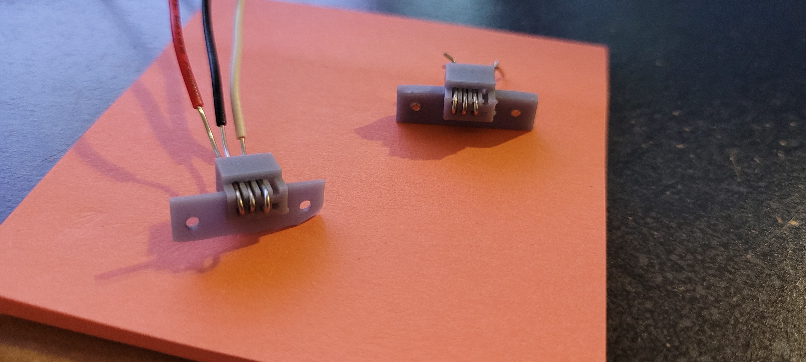
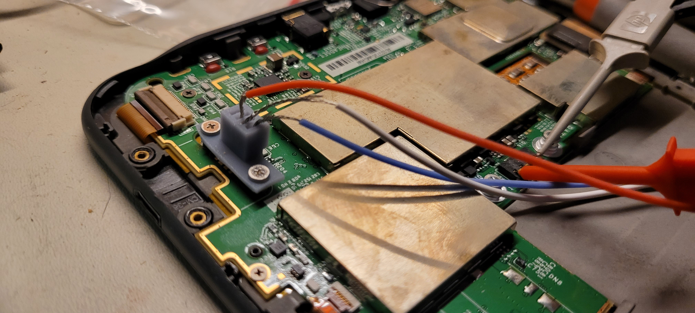
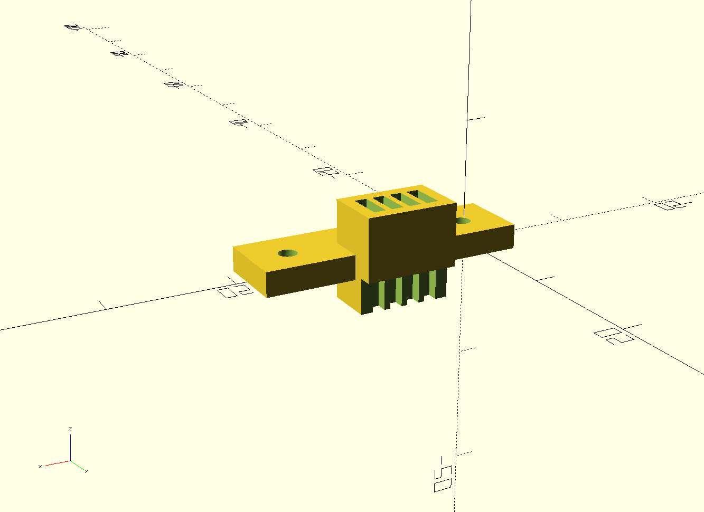
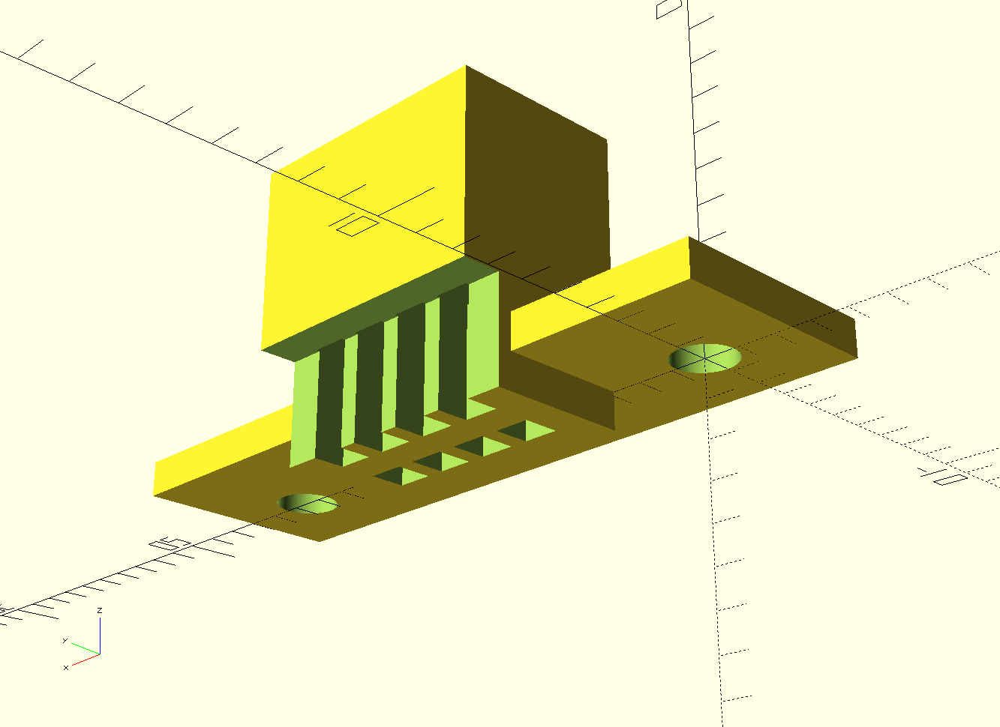

Helo

# Kindle 3 / Kindle Keyboard no-solder UART jig

Made a little jig that you can run some wires through and then plug it into your Kindle 3 to access that UART.

I got it to work pretty well V2 with stranded wire, but the bottom of the jig still needs to sit a little lower so that the screws tighten it down onto the board.  V1 was way to tall, and you couldn't use the screws to hold it in at all.

## Version 1

## Version 2

