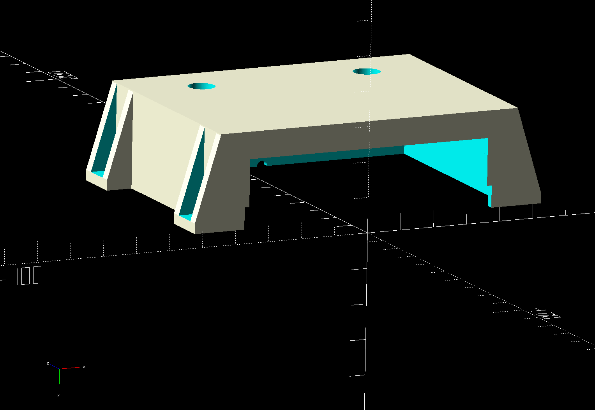

# Power supply enclosure

You can buy these small DC-DC rack mountable power supply's for very cheap
online.  But their is no case for the back of them.

Search for things like DPS3003.

EEVBlog Review of one:
https://youtu.be/qWAqSSLwBtw

Since there is no case, I decided to make one for myself.  Most of the existing
case designs I found online had DC barrel jacks and on/off switches that I
didn't want.

I had an old laptop charger (19V) for a dead laptop that I thought should work
good.  Most applications I would use would be 3.3V to 12V circuits, so 19V
should be fine.

## Extra hardware you need

* Your own AC-DC external power supply brick to sacrifict to power this
* 4 M3 * 12 screws
* 4 M3 nuts
* 2 Binding posts

## Design pictures

## As printed

