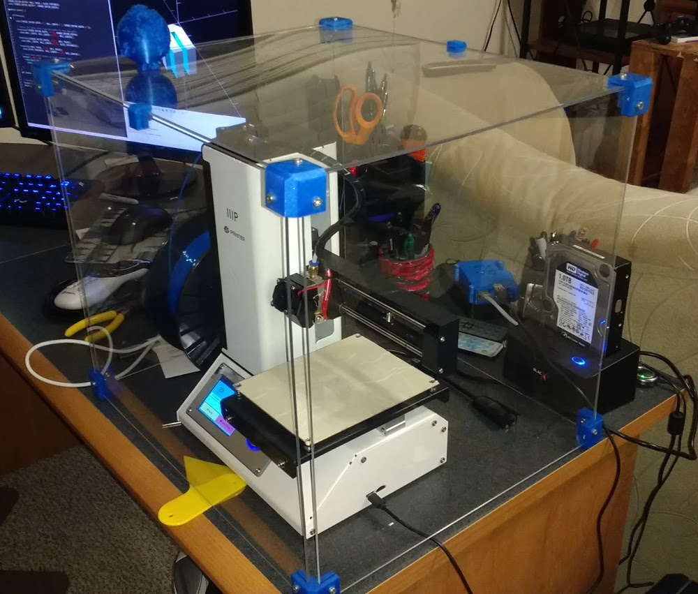

# 3-D Printer Enclosure

Wanted to create an enclosure for my 3d printer to help control temperatures around the printer
bed while it is printing.  My printer is on my desk, and there is an AC vent very close to it
that would create big temperature differences as the AC cycles on and off.

Also was hoping that it would help my ability to print with ABS plastic (it didn't, the Mono
Price Mini printer doesn't have a bed that will heat up to the recommended printing temperature
for print ABS plastics.

## How to make

I bought some sheets of polycarbonate from local hardware store (I don't think it was Lexan, I
think Home Depot had a less pricey alternative available in their store).  I then cut the sheets
to form 2 sides, a front, a back, and a top for my 3d printer enclosure.

I then printed 8 corner pieces to join all the pieces together, and ordered some metric machine
screws online to secure everything.  Some of the corners had issues during printing, and
conveniently were still functional as bottom pieces, and the good prints were still usable for
the top corners.

Later on after using the enclosure for a while, it naturally got things laid on top of it from
time to time, and I noticed that the plastic sheets would sag in the middle under the extra
weight.  I added 2 middle supports to lessen the sagging.

## Renders

## Final Enclosure As Assembled

